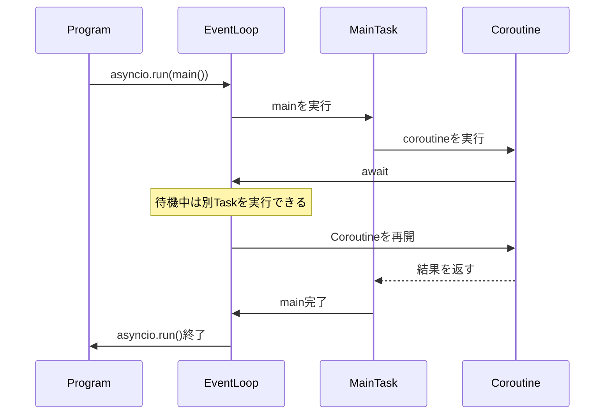
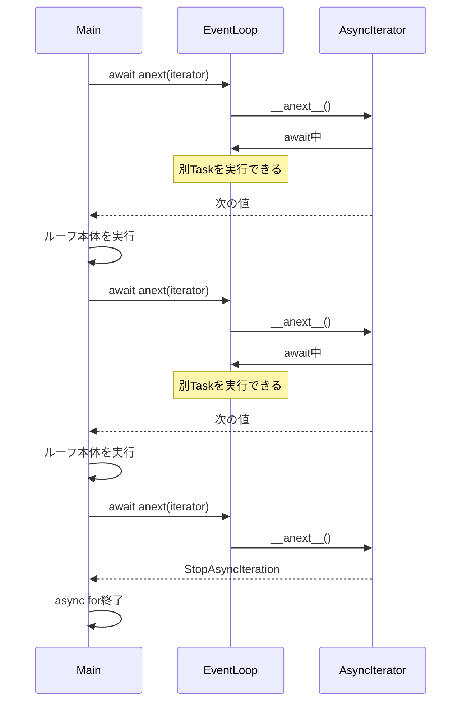
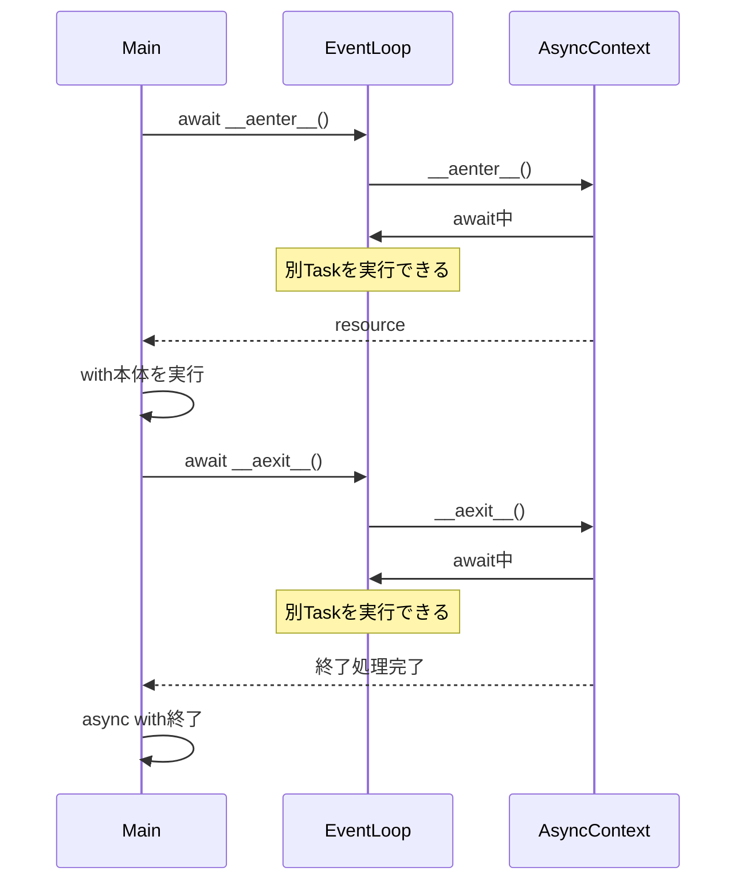
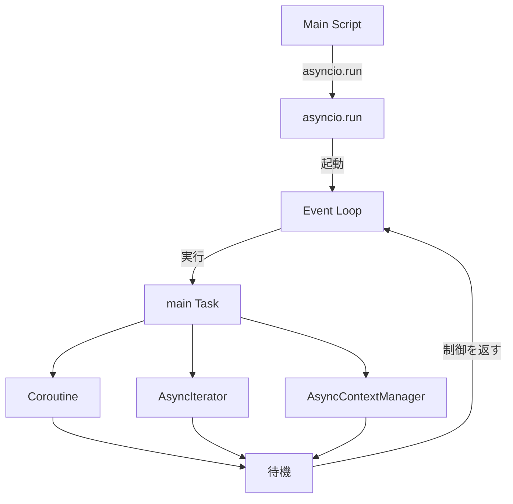

# learn async

- step1
  - 最小実行コード
  - 1秒待つ
- step2
  - 1秒待つタスクを非同期に2つ実行
- step3
  - 1, 2, 3秒待つタスクを非同期に実行
- step4
  - async forのサンプル
  - ジェネレータの中(生成処理)でawaitで非同期処理が走る
- step5
  - async withのサンプル
  - コンテキスト処理(enter, exit)でawaitで非同期処理が走る

## step1 ~ 3の構造図

## step4 (async for)

## step5 (async with)

## まとめ

- asyncio.run
  - Event Loopの実行
- async def
  - 関数を「途中で await してEvent Loopに制御を返せるCoroutine」にする
- async for
  - 次の値を取得する処理（\_\_anext\_\_）で await してEvent Loopに制御を返せる
- async with
  - コンテキストの開始（\_\_aenter\_\_）・終了（\_\_aexit\_\_）で await してEvent Loopに制御を返せる

