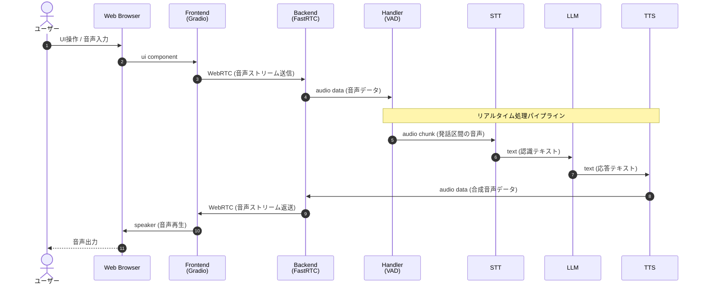
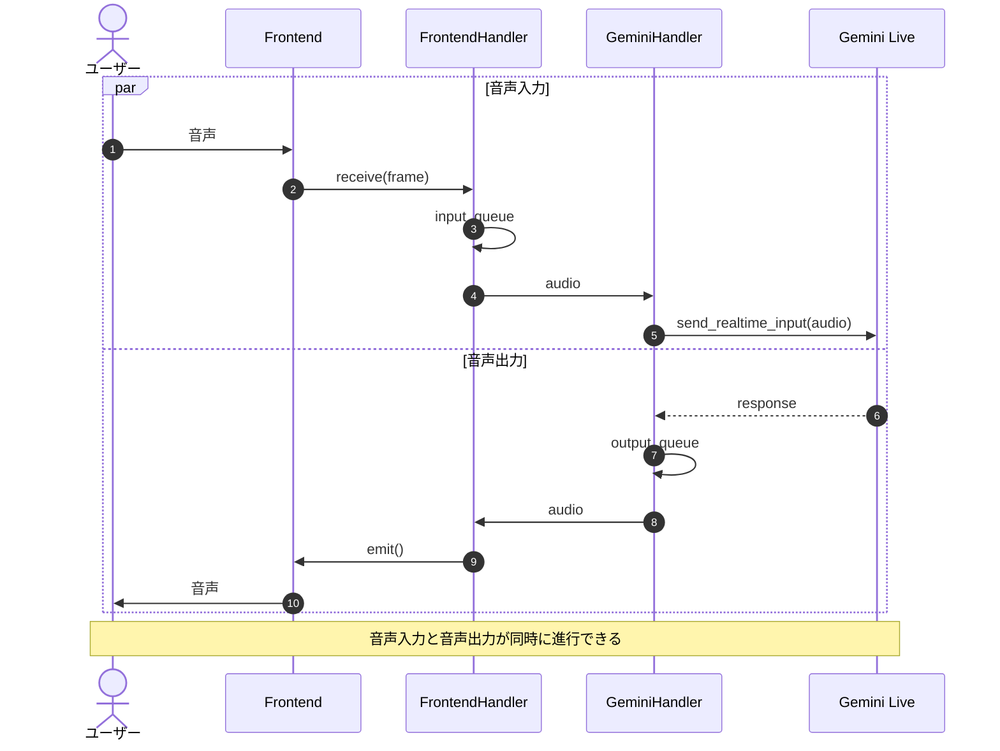

# Learn FastRTC

[gradio-app/fastrtc | Github](https://github.com/gradio-app/fastrtc)

## memo

- setup
  - `uv sync`
- echo_audio.py
  - `uv run python echo_audio.py`
  - README記載のQuickstartのコードを動かす
  - サーバが起動して、WebブラウザでアクセスするとビルトインのUIが起動
  - 発話を拾って、区切りを検出すると発話をそのままエコーする
- llm_voice_chat.py
  - `uv run python llm_voice_chat.py`
  - README記載のQuickstartのコードをollamaなどローカルLLMで再現した物
  - 精度などは悪いが音声入力 > 書き起こし > LLM入力 > 結果受け取り > 音声合成 > 音声出力の流れを追うことができる
- gemini_voice_chat.py
  - `export GEMINI_API_KEY=<your key>`
  - `uv run python gemini_voice_chat.py`
  - README記載のQuickstartのコードをGeminiで再現した物
  - ローカルLLMよりは応答をしてくれる
  - gemini-3.1-flash-tts-previeはRateLimitの制限が厳しい
- echo_audio_live.py
  - `uv run python echo_audio_live.py`
  - AsyncStreamHandlerを用いた全二重通信のサンプル
  - 発話を即時そのままエコーする(ハウリングするため注意)
- delayed_echo_audio_live.py
  - `uv run python delayed_echo_audio_live.py`
  - AsyncStreamHandlerを用いた全二重通信のサンプル
  - 発話を1フレーム遅延させてそのままエコーする(ハウリングするため注意)
- gemini_voice_chat_live.py
  - `export GEMINI_API_KEY=<your key>`
  - `uv run python gemini_voice_chat_live.py`
  - AsyncStreamHandlerを用いた全二重通信でGeminiとの接続を行うサンプル
  - Agentの発話に割り込んだ会話などができる
- gemini_voice_chat_live_ref.py
  - `export GEMINI_API_KEY=<your key>`
  - `uv run python gemini_voice_chat_live_ref.py`
  - gemini_voice_chat_live.pyをリファクタリングして、概念をわかりやすくしたサンプル

## note

### 半二重通信のフロー

- VAD(Voice Activity Detection / 発話区間検出)で発話区切りが検出されると、Text to Speach、LLM、Speach to Textと逐次データが流れていく構成
- 半二重通信で交代で話す構成になっている

### 全二重通信のフロー

- 非同期に音声入力と音声出力を処理することで、双方向に音声を送受信する構成
- 全二重通信で双方が同時に話す/聞くが行える構成になっている
