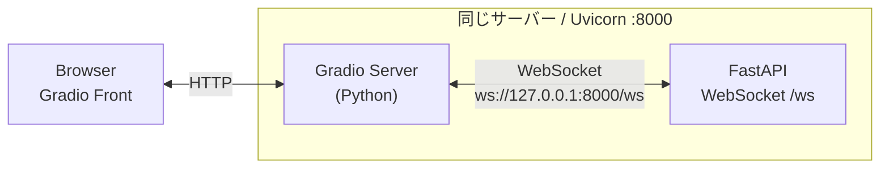

# learn websocket step1.5

step1のFrontendのGradioサーバーとBackendのFastAPIサーバーをひとつのプロセスに統合したもの

```bash
uv run python server.py
```



- Gradioは、ブラウザ側（Gradio Frontend）とサーバー側（Gradio Server / Python）から構成される
- WebSocket接続を張っているのは、Gradioのサーバー側PythonとFastAPIのWebSocketエンドポイント /ws の間
- かつ、同一ホスト内の同一プロセスでのローカルホスト通信となっている
