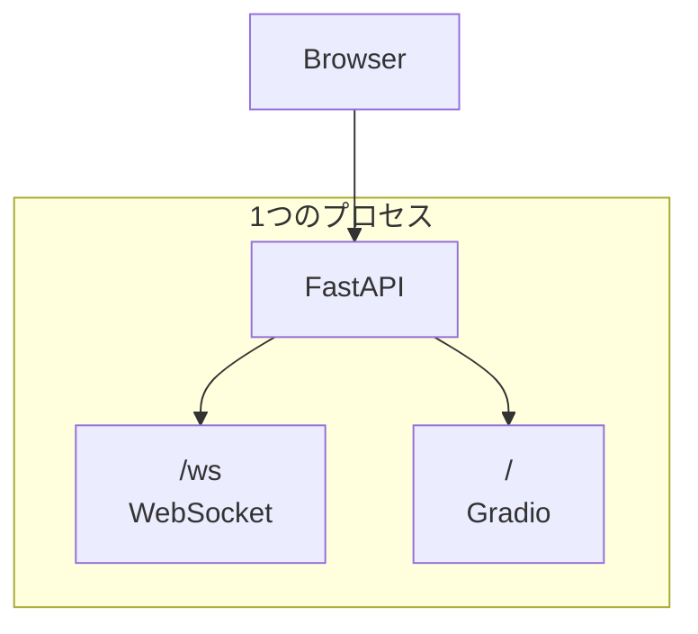

# learn websocket step1.5

step1のFrontendのGradioサーバーとBackendのFastAPIサーバーをひとつのプロセスに統合したもの

```mermaid
flowchart TB
    B[Browser]

    subgraph P["1つのプロセス"]
        F[FastAPI]

        WS["/ws<br/>WebSocket"]
        G["/<br/>Gradio"]

        F --> WS
        F --> G
    end

    B --> F
```
