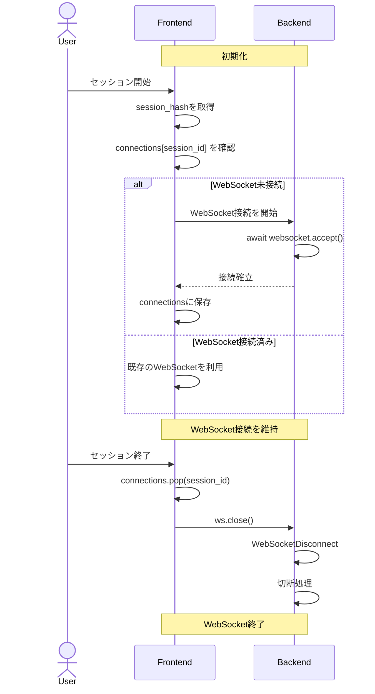
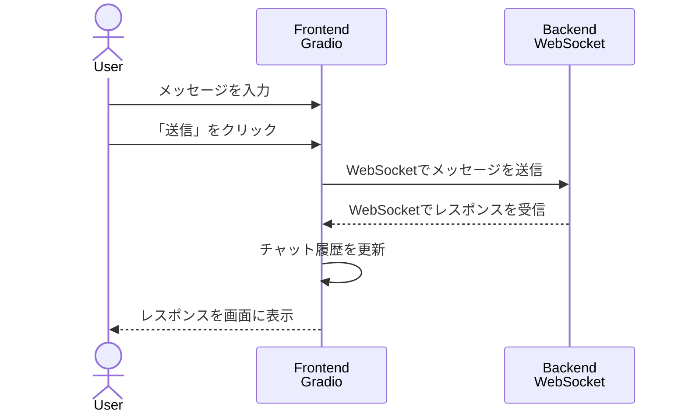

# learn websocket step1

echo chatの実装

```
# プロセス1
uv run python backend/app.py

# プロセス2
uv run python frontend/app.py
```

## シーケンス図

### Websocketの初期化


```mermaid
sequenceDiagram
    actor User
    participant Frontend as Frontend
    participant Backend as Backend

    Note over Frontend,Backend: 初期化

    User->>Frontend: セッション開始

    Frontend->>Frontend: session_hashを取得
    Frontend->>Frontend: connections[session_id] を確認

    alt WebSocket未接続
        Frontend->>Backend: WebSocket接続を開始
        Backend->>Backend: await websocket.accept()
        Backend-->>Frontend: 接続確立
        Frontend->>Frontend: connectionsに保存
    else WebSocket接続済み
        Frontend->>Frontend: 既存のWebSocketを利用
    end

    Note over Frontend,Backend: WebSocket接続を維持

    User->>Frontend: セッション終了

    Frontend->>Frontend: connections.pop(session_id)
    Frontend->>Backend: ws.close()
    Backend->>Backend: WebSocketDisconnect
    Backend->>Backend: 切断処理

    Note over Frontend,Backend: WebSocket終了
```

### Frontend


```mermaid
sequenceDiagram
    actor User
    participant Frontend as Frontend<br/>Gradio
    participant Backend as Backend<br/>WebSocket

    User->>Frontend: メッセージを入力
    User->>Frontend: 「送信」をクリック

    Frontend->>Backend: WebSocketでメッセージを送信
    Backend-->>Frontend: WebSocketでレスポンスを受信

    Frontend->>Frontend: チャット履歴を更新
    Frontend-->>User: レスポンスを画面に表示
```

### Backend


```mermaid
sequenceDiagram
    actor User
    participant Frontend as Frontend<br/>Gradio
    participant Backend as Backend<br/>WebSocket

    User->>Frontend: メッセージを入力
    User->>Frontend: 「送信」をクリック

    Frontend->>Backend: WebSocketでメッセージを送信
    Backend-->>Frontend: WebSocketでレスポンスを受信

    Frontend->>Frontend: チャット履歴を更新
    Frontend-->>User: レスポンスを画面に表示
```