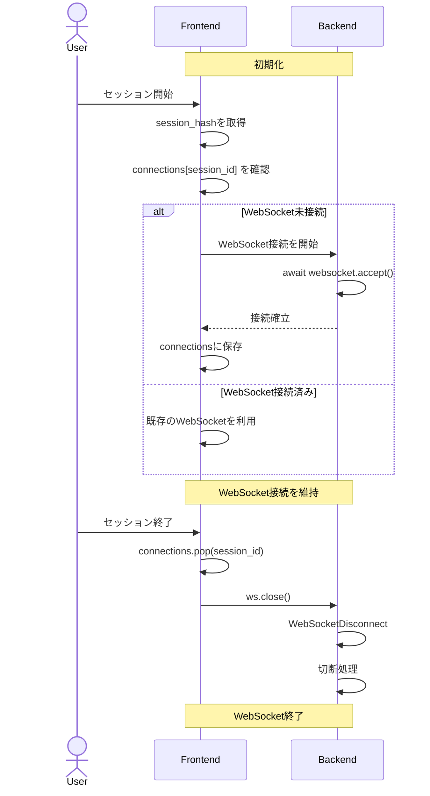
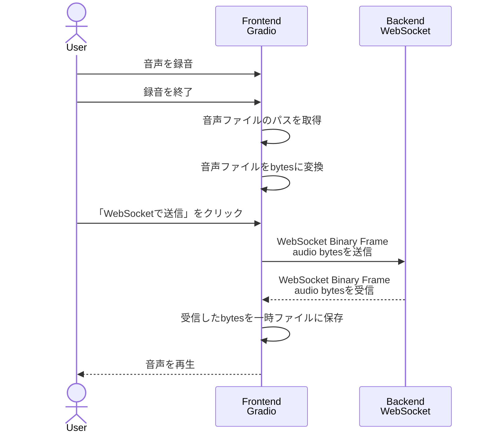
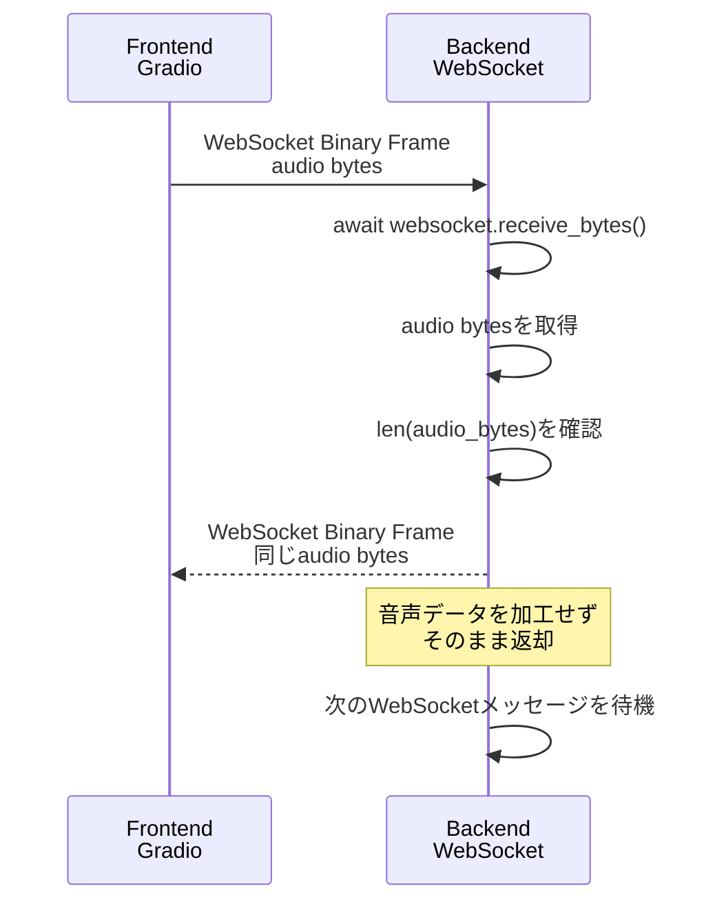

# learn websocket step2

音声を録音してバイナリファイルとしてwebsocketでやりとりする

```
# プロセス1
uv run python backend/app.py

# プロセス2
uv run python frontend/app.py
```

## チャット実装との差分

| | テキストチャット | 音声 |
|---|---|---|
| 入力 | テキスト | 録音した音声ファイル |
| Pythonで取得 | `str` | `bytes` |
| WebSocket送信 | Text Frame | Binary Frame |
| FastAPI受信 | `receive_text()` | `receive_bytes()` |
| Backend処理 | `message + "!"` | そのまま |
| WebSocket返却 | `send_text()` | `send_bytes()` |
| Frontend表示 | Chatbot | Audio |

## シーケンス図

### WebSocketの初期化



### Frontend



### Backend


