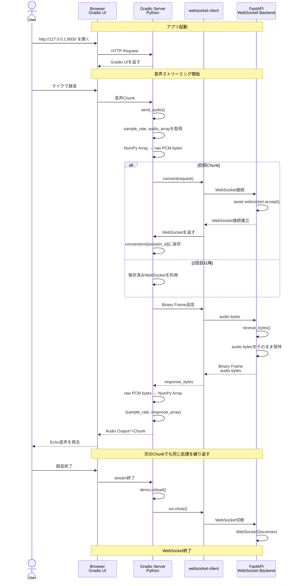

# learn websocket step3

音声ストリーミングをWebSocketでechoする

## シーケンス図

### 全体のフロー

- Gradio Frontend
  - Audio入出力のUI
- Gradio Server
  - Audioデータのストリーム受け取り
- FastAPI Server
  - Audtioデータを加工 (そのまま返す)
- 経路
  - Gradio FE <-Audio-> Gradio BE <-Audio/WS-> FastAPI
